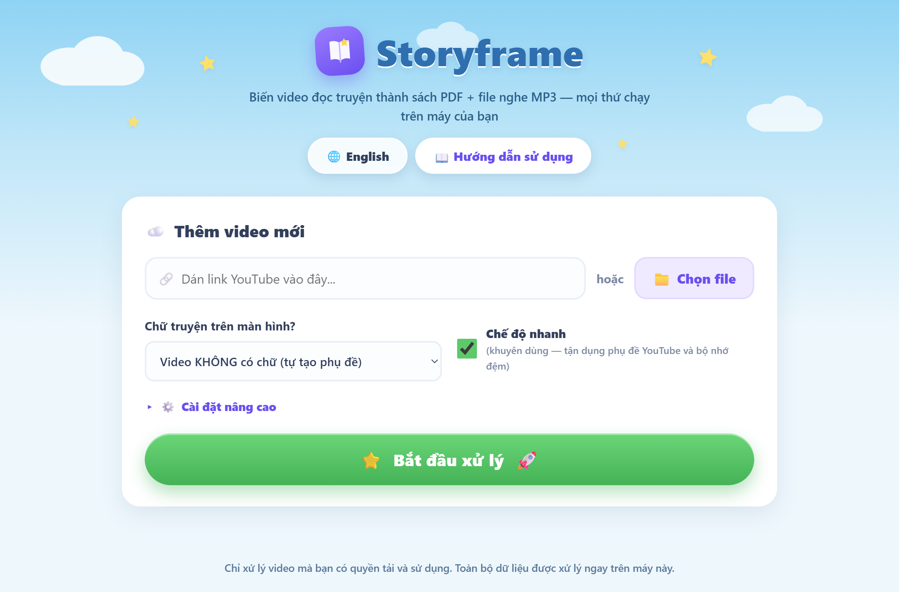

<h1 align="center">📖 Storyframe</h1>

<p align="center">
  
</p>

<p align="center">
Turn a read-aloud story video into a <b>PDF picture book</b> and an <b>MP3</b> of the narration — right on your own computer.<br>
<i>Biến video đọc truyện thành <b>sách PDF</b> và file <b>MP3</b> giọng đọc — ngay trên máy tính của bạn.</i>
</p>

> A friendly fork of [storyframe-cli](https://github.com/thieung/storyframe-cli): it adds an easy bilingual app (Vietnamese / English), a Windows installer, and a one-click launcher.
> <br>_Bản fork thân thiện của [storyframe-cli](https://github.com/thieung/storyframe-cli): bổ sung ứng dụng song ngữ (Việt / Anh) dễ dùng, trình cài đặt cho Windows, và file khởi chạy một-cú-nhấp._

<p align="center"><sub>Each block shows English first, then <i>Tiếng Việt</i> underneath · Mỗi đoạn có tiếng Anh trước, rồi <i>tiếng Việt</i> ở dưới</sub></p>

<p align="center">
  <a href="https://github.com/nguyennhuanhle/storyframe-plus/releases/latest"><b>⬇ Download the installer</b></a>
  · <a href="https://github.com/nguyennhuanhle/storyframe-plus/releases/latest"><b>Tải bản cài đặt</b></a>
</p>

<p align="center"><sub>
No Git, no setup — download <code>StoryframeSetup.exe</code> from Releases and run it.<br>
<i>Không cần Git, không cần cài lằng nhằng — tải <code>StoryframeSetup.exe</code> từ Releases rồi chạy.</i>
</sub></p>

---

## What it does · Ứng dụng làm gì?

Give Storyframe a story video (like the animated read-aloud storybooks on YouTube) and it gives you back two things you can keep:
<br>_Đưa cho Storyframe một video đọc truyện (ví dụ video đọc sách thiếu nhi trên YouTube), nó trả lại hai thứ bạn có thể lưu giữ:_

- 📄 a **PDF** — each page of the story as a picture · _một file **PDF** — mỗi trang truyện là một tấm ảnh_
- 🎵 an **MP3** — the narration audio · _một file **MP3** — phần giọng đọc_

Everything runs on your own machine. Nothing is uploaded — the only time it goes online is to download the video from YouTube.
<br>_Mọi thứ chạy trên máy của bạn. Không có gì bị tải lên mạng — chỉ khi tải video từ YouTube mới cần internet._

## Get it running (Windows) · Cài đặt & chạy (Windows)

**The easy way — install it.** Nothing to set up by hand.
<br>_**Cách dễ nhất — cài đặt.** Không phải cài gì thủ công._

1. Open the [**latest release**](https://github.com/nguyennhuanhle/storyframe-plus/releases/latest) and download **`StoryframeSetup-…-x64.exe`**.
   <br>_Mở [**bản phát hành mới nhất**](https://github.com/nguyennhuanhle/storyframe-plus/releases/latest) và tải **`StoryframeSetup-…-x64.exe`**._
2. Run it. If Windows shows a blue **"unknown publisher"** warning, click **More info → Run anyway** (the app isn't code-signed yet).
   <br>_Chạy file. Nếu Windows hiện cảnh báo **"unknown publisher"**, bấm **More info → Run anyway** (app chưa ký số)._
3. Open **Storyframe** from the Desktop or Start Menu. The first video you process downloads a ~0.5 GB AI model.
   <br>_Mở **Storyframe** từ Desktop hoặc Start Menu. Video đầu tiên sẽ tải model AI ~0.5 GB._

Prefer not to install? Grab the **portable** zip from the same release, unzip it, and run `Storyframe.vbs`.
<br>_Không muốn cài? Tải bản **portable** ở cùng release, giải nén rồi chạy `Storyframe.vbs`._

<details>
<summary><b>Run from source instead (with Git, no installer) · Chạy từ mã nguồn (không cần installer)</b></summary>

<br>

1. Download this project — green **Code** button → **Download ZIP**, then unzip. (Or clone it.)
   <br>_Tải dự án — nút **Code** màu xanh → **Download ZIP**, rồi giải nén. (Hoặc clone.)_
2. Double-click **`start.bat`**.
   <br>_Nhấp đúp **`start.bat`**._
3. Wait — the first run installs Python, `ffmpeg` and `deno` automatically, then opens the app in your browser.
   <br>_Chờ — lần đầu tự cài Python, `ffmpeg` và `deno`, rồi mở app trong trình duyệt._

> 💡 A black window full of text during setup is normal — don't close it while using the app.
> <br>💡 _Cửa sổ nền đen khi cài là bình thường — đừng đóng nó khi đang dùng app._

</details>

## How to use it · Cách sử dụng

1. **Paste a YouTube link** into the box, or click **Chọn file** (Choose file) to pick a video already on your computer.
   <br>_**Dán link YouTube** vào ô, hoặc bấm **Chọn file** để chọn video có sẵn trên máy._
2. Choose **whether the story text already appears on screen**:
   <br>_Chọn **“Chữ truyện trên màn hình?”**:_
   - **Video has NO text** (default) — the app listens to the narration and adds subtitles for you · _mặc định — app nghe giọng đọc và tự thêm phụ đề_
   - **Video HAS text on screen** — pick this when the story words are already shown on the video · _chọn khi chữ truyện đã hiện sẵn trên video_
3. Leave **Fast mode** turned on — it's quicker.
   <br>_Để nguyên **Chế độ nhanh** (đang bật) — sẽ chạy nhanh hơn._
4. Click **Bắt đầu xử lý** (Start).
   <br>_Bấm **Bắt đầu xử lý**._

You'll see easy-to-follow progress. A long video can take 10–40 minutes — normal for the on-device AI. When it's done you can play the MP3, open or download the PDF, review and remove pages (then rebuild the PDF in seconds), or delete the whole project.
<br>_Bạn sẽ thấy tiến độ dễ hiểu. Video dài có thể mất 10–40 phút — bình thường với AI chạy trên máy. Khi xong: nghe MP3, mở/tải PDF, xem lại và bỏ bớt trang (rồi tạo lại PDF trong vài giây), hoặc xóa cả dự án._

For more detail, open the **Hướng dẫn sử dụng** (User guide) button inside the app.
<br>_Muốn chi tiết hơn, bấm nút **Hướng dẫn sử dụng** trong app._

### Copying a YouTube link · Sao chép link YouTube

Open the video on youtube.com, click **Share** below the video, then **Copy** — or copy the address from your browser's address bar. A link looks like `https://www.youtube.com/watch?v=XXXXXXXXXXX`.
<br>_Mở video trên youtube.com, bấm **Chia sẻ** dưới video, rồi **Sao chép** — hoặc chép địa chỉ trên thanh trình duyệt. Link trông giống `https://www.youtube.com/watch?v=XXXXXXXXXXX`._

## Good to know · Cần biết

- The interface is **bilingual** — switch between Tiếng Việt and English with the **🌐** button at the top (default Vietnamese).
  <br>_Giao diện **song ngữ** — đổi giữa Tiếng Việt và English bằng nút **🌐** ở trên (mặc định Tiếng Việt)._
- Storyframe is **local and free**. The first run downloads a ~0.5 GB speech-recognition AI model; after that it works offline (except YouTube downloads).
  <br>_Storyframe **chạy local và miễn phí**. Lần đầu tải một model AI nhận diện giọng nói ~0.5 GB; sau đó dùng được offline (trừ khi tải video YouTube)._
- Only process videos you have the right to download, transform, and store.
  <br>_Chỉ xử lý video mà bạn có quyền tải, chuyển đổi và lưu trữ._

## License · Giấy phép

This fork's own contributions are released under the [MIT license](LICENSE). It is a fork of [storyframe-cli](https://github.com/thieung/storyframe-cli) (which is unlicensed) and bundles third-party components under their own licenses — see [NOTICE.md](NOTICE.md).
<br>_Phần đóng góp của bản fork này phát hành theo [giấy phép MIT](LICENSE). Đây là fork của [storyframe-cli](https://github.com/thieung/storyframe-cli) (repo gốc không có license) và có bundle các thành phần bên thứ ba theo giấy phép riêng của chúng — xem [NOTICE.md](NOTICE.md)._

<details>
<summary><b>For advanced users: command line &amp; manual install · Nâng cao: dòng lệnh &amp; cài đặt thủ công</b></summary>

<br>

**Manual install (any platform)** · _Cài đặt thủ công (mọi nền tảng)_

System tools · _Công cụ hệ thống_:

```bash
# Windows
winget install Gyan.FFmpeg DenoLand.Deno
# macOS
brew install ffmpeg
# Linux
sudo apt-get install ffmpeg
```

`ffmpeg` is required. `deno` (or another yt-dlp JS runtime) is required for YouTube downloads. `tesseract` is optional (OCR fallback only).
<br>_`ffmpeg` là bắt buộc. `deno` (hoặc JS runtime khác cho yt-dlp) là bắt buộc để tải YouTube. `tesseract` là tùy chọn (chỉ dùng làm OCR dự phòng)._

```bash
git clone https://github.com/nguyennhuanhle/storyframe-plus.git
cd storyframe-plus
python3 -m venv .venv
source .venv/bin/activate          # Windows: .venv\Scripts\activate
python -m pip install -U pip
python -m pip install -e ".[local,gui]"
```

Python 3.11+ is required. Extras: `local` (the processing pipeline) and `gui` (the web app).
<br>_Cần Python 3.11+. Extras: `local` (pipeline xử lý) và `gui` (ứng dụng web)._

**Start the web GUI** · _Mở giao diện web_:

```bash
storyframe gui
```

**Command line** · _Dòng lệnh_:

```bash
# YouTube, local file, or a whole folder · YouTube, file local, hoặc cả folder
storyframe run "https://www.youtube.com/watch?v=VIDEO_ID"
storyframe run "/path/to/book.mp4"
storyframe run "/path/to/video-folder" --recursive

# Video with no on-screen text (render captions) · Video không có chữ (vẽ phụ đề)
storyframe run "https://www.youtube.com/watch?v=VIDEO_ID" --caption-mode force

# Faster reruns using YouTube captions + cache · Rerun nhanh hơn nhờ phụ đề + cache
storyframe run "https://www.youtube.com/watch?v=VIDEO_ID" --speed auto

# Use browser cookies if YouTube asks to sign in · Dùng cookies nếu YouTube đòi đăng nhập
storyframe run "https://www.youtube.com/watch?v=VIDEO_ID" --cookies-from-browser chrome
```

Each video writes to `outputs/storyframe-runs/<video-name>/` containing `<video-name>.mp3`, `<video-name>.pdf`, `frames/*.jpg`, `review-index.csv`, `review-contact-sheet.jpg`, and `manifest.json`.
<br>_Mỗi video ghi vào `outputs/storyframe-runs/<video-name>/` gồm các file trên._

Help · _Trợ giúp_: `storyframe run --help` · `storyframe run --advanced-help`

**CPU tips** · _Mẹo CPU_: the heavy steps are OCR, scene detection, and local speech recognition. `--speed auto` reuses YouTube captions and an OCR/frame cache, so reruns are much lighter. If the machine runs hot, cap threads:
<br>_Các bước nặng là OCR, scene detection, và nhận diện giọng nói local. `--speed auto` tận dụng phụ đề YouTube và cache nên rerun nhẹ hơn. Nếu máy nóng, giới hạn threads:_

```bash
OMP_NUM_THREADS=2 OPENBLAS_NUM_THREADS=2 \
storyframe run "https://www.youtube.com/watch?v=VIDEO_ID" --speed auto
```

**Development** · _Phát triển_:

```bash
python3 -m unittest discover -s tests
python3 -m storyframe_cli gui
```

</details>
